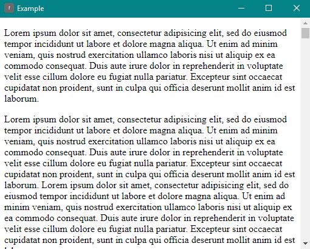

# "Find" in NW.js

Adds "Ctrl+F" find box to highlight text in the DOM




## Use

1. `npm install --save findinnw`
1. In your HTML file add:
    ```html
    <script src="node_modules/findinnw/dist/find-in-nw.js"></script>
    <script>
      findInNw.initialize();
    </script>
    ```
1. Use `CTRL+F` and `ESC` to show/hide the search box


## API


### `findInNw.initialize();`

This is the initialization command. It must be ran once. Multiple attempts to run it are ignored.


### `findInNw.showSearchBox();`

This is used to programmitcally display the search box. `CTRL+F` will still display it too.


### `findInNw.hideSearchBox();`

This is used to programmitcally hide the search box. `ESC` will still hide it too.


### `findInNw.search('Text to find');`

This is used to programmitcally find text.


### `findInNw.clearTokens();`

This is used to remove all the highlighted tokens.


## Customizing Styles


### Highlight tokens

All highlight tokens of matching searched text will be wrapped in a `<mark class="find-in-nw-token">searched text</mark>`. You can customize this by targeting the following

```css
mark.find-in-nw-token {
    background-color: #00F;
}
```


### Search Box

Each element of the search box is styled by targeting a class. They also all have a matching ID that you can target to override them.

```css
/* The container for the input/count/close */
#find-in-nw-search-box {}

/* The input field you type in */
#find-in-nw-input {}

/* The count of matching highlighted items */
#find-in-nw-count {}

/* The X close button */
#find-in-nw-close {}
```


## Contributing

1. Create an issue first for your desired improvements and how you think they should be implemented.
1. If plan is approved (or no response given in a timely manner), then you can submit a PR.
1. Make sure to run `npm run validate` prior to submitting your PR and fix any errors or warnings.
