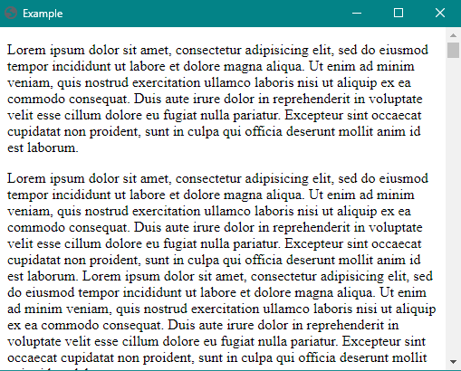

# "Find" in NW.js

Adds "Ctrl+F" find box to highlight text in the DOM




## Use

1. `npm install --save findinnw`
1. In your HTML file add:
    ```html
    <script src="node_modules/findinnw/dist/find-in-nw.js"></script>
    <script>
      findInNw.initialize();
    </script>
    ```
1. Use `CTRL+F` to display and give focus to the search box
1. After typing, press `ENTER` to go to highlight/scroll to the next match.
1. Use `TAB` to navigate to the "previous", "next", and "close" buttons.
1. Use `ENTER` or `SPACE` to activate a button when focused.
1. User `ESC` to hide the search box and return focus to the body


## API


### `findInNw.initialize(options);`

This is the initialization command. It must be ran once. You can pass any any options from [findAndReplaceDOMText](https://github.com/padolsey/findAndReplaceDOMText#options).


### `findInNw.showSearchBox();`

This is used to programmitcally display the search box. `CTRL+F` will still display it too.


### `findInNw.hideSearchBox();`

This is used to programmitcally hide the search box. `ESC` will still hide it too.


### `findInNw.search('Text to find');`

This is used to programmitcally find text.


### `findInNw.highlightNext();` and `findInNw.highlightPrevious();`

This will highlight and scroll to the next or previous match.


### `findInNw.clearTokens();`

This is used to remove all the highlighted tokens.


## Customizing Styles


### Highlight tokens

All highlight tokens of matching searched text will be wrapped in a `<mark class="find-in-nw-token">searched text</mark>`.

They will also contain a `data-find-in-nw-position="4"` data attribute, the number correlates to a zero-based index of all matches.

As you navigate from one match to the next, the currently selected match will have a class of `.find-in-nw-current-token`.

You can customize this by targeting the following

```css
mark.find-in-nw-token {
    background-color: #00F;
}

mark.find-in-nw-current-token {
    background-color: #38D878;
}
```


### Search Box

Each element of the search box is styled by targeting a class. They also all have a matching ID that you can target to override them.

```css
/* The container for the input/count/close */
#find-in-nw-search-box {}

/* The input field you type in */
#find-in-nw-input {}

/* The current selected match number. Ex: The number 1 in "1/5" */
#find-in-nw-current {}

/* The separator between the current and count. Ex: The slash (/) in "1/5" */
#find-in-nw-of {}

/* The count of matching highlighted items. Ex: The number 5 in "1/5" */
#find-in-nw-count {}

/* The case sensitivty toggle, Ex: Aa button */
#find-in-nw-case-sensitive {}

/* The previous and next buttons, ∧ and ∨ */
#find-in-nw-previous {}
#find-in-nw-next {}

/* The × close button */
#find-in-nw-close {}
```


## Contributing

1. Create an issue first for your desired improvements and how you think they should be implemented.
1. If plan is approved (or no response given in a timely manner), then you can submit a PR.
1. Make sure to run `npm run validate` prior to submitting your PR and fix any errors or warnings.
